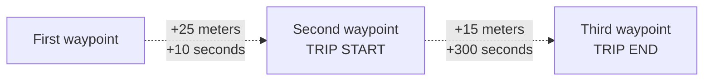

# Vimcar Coding Challenge: Trip Extraction

One of Vimcar's successful products is the digital logbook. The purpose of a logbook is to maintain a complete, consistent list of all trips a vehicle has made over time.

There are many different use-cases for this, one of them is taxation. Our customers e.g. maintain a logbook, to keep track of how many trips were made privately and how many kilometers were driven in a business context.

## The trip extraction

The central piece of the logbook is the trip extraction. Trip extraction is the process of determining when a vehicle starts and stops moving based on data collected by gps trackers (Waypoints).

When driving from A to B, a user will probably have interruptions like stopping at red lights, traffic jams, tunnels. The expected behavior is to have one trip accounting for the whole journey, and not broken trips like from A to first red light etc.

GPS technology has some limitations which the trip extraction should account for. Within cities the GPS precision may be poorer than 15 meters and the GPS position might even "jump", due to bad reception caused by reflections on building. There are places without gps signal like tunnels and underground parking lots.

## The task

Your challenge is to deliver a simplified version of the trip extraction. That is, write a program that, based on a list of Waypoints, outputs a list of identified Trips.

A Waypoint is the GPS data that a vehicle sends every few seconds, and it consist of the following fields:

- `timestamp` – string, when the GPS measurement was taken as an ISO 8601 formatted date string
- `lat` – float, latitude of the GPS coordinate (WGS84)
- `lng` – float, longitude of the GPS coordinate (WGS84)

And a Trip must have this information:

- `start` – Waypoint, the start of the trip
- `end` – Waypoint, the end of the trip
- `distance` – int, the sum of distances between the trip's Waypoints in meters

You are free to determine how to store Waypoints (JSON, CSV, a database, etc) and how the resulting Trips should be delivered (again as JSON, CSV, logged to standard output, saved to a file, etc).

Please provide along with your code an example list of Waypoints and the corresponding expected Trips.

To identify the Trips you need to observe the following rules:

- A Trip starts when the distance between two Waypoints is greater than 20 meters
- A Trip ends when the vehicle remains within a 20 meters radius for 5 minutes
- If the speed from one Waypoint to the previous is greater than 300 km/h, this is considered a GPS "jump" and the Waypoint should be discarded

So, as a contrived example, the smallest possible Trip has 3 Waypoints.

This represents a Trip with total distance of 15 meters (and no "jump" Waypoints).

## Evaluation

What we are looking for:

- Your code should have meaningful tests. We don’t expect 100% coverage.
- Communication is crucial to us, and this reflects both in documentation and code (is your code easy to read and understand?). You can also let us know what improvements could be made in the future and where you had to cut corners due to time constraints.
- You can use whatever library you think makes sense.
- Be mindful of edge cases and error handling.
- Read the rules carefully. If you don’t understand something feels free to ask us.
